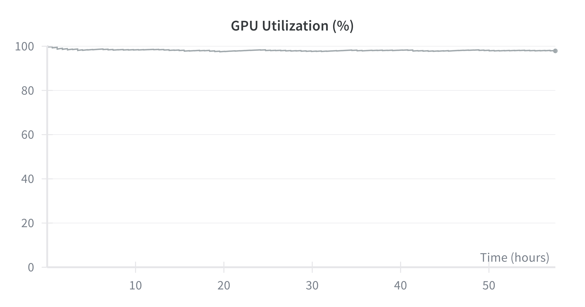

<h1 align="center">
    <p> <b>stable-worldmodel</b></p>
</h1>

<h2 align="center">
    <p><i>World model research made simple. From data collection to training and evaluation.</i></p>
</h2>

<div align="center" style="line-height: 1;">
  <a href="https://galilai-group.github.io/stable-worldmodel/" target="_blank" style="margin: 2px;"></a>
  <a href="https://github.com/galilai-group/stable-worldmodel" target="_blank" style="margin: 2px;"></a>
  <a href="https://pypi.python.org/pypi/stable-worldmodel/#history" target="_blank" style="margin: 2px;"></a>
  <a href="https://pytorch.org/get-started/locally/" target="_blank" style="margin: 2px;"></a>
  <a href="https://github.com/astral-sh/ruff" target="_blank" style="margin: 2px;"></a>
</div>

<p align="center">
  <a href="#quick-example"><b>Quick Example</b></a> | <a href="#supported-environments"><b>Environments</b></a> | <a href="#installing-stable-worldmodel"><b>Installation</b></a> | <a href="https://galilai-group.github.io/stable-worldmodel/"><b>Documentation</b></a> | <a href="#contributing"><b>Contributing</b></a> | <a href="#citation"><b>Citation</b></a>
</p>


## Quick Example

```python
import stable_worldmodel as swm
from stable_worldmodel.data import HDF5Dataset
from stable_worldmodel.policy import WorldModelPolicy, PlanConfig
from stable_worldmodel.solver import CEMSolver

# collect a dataset
world = swm.World('swm/PushT-v1', num_envs=8)
world.set_policy(your_expert_policy)
world.record_dataset(dataset_name='pusht_demo', episodes=100)

# load dataset and train your world model
dataset = HDF5Dataset(name='pusht_demo', num_steps=16)
world_model = ...  # your world-model

# evaluate with model predictive control
solver = CEMSolver(model=world_model, num_samples=300)
policy = WorldModelPolicy(solver=solver, config=PlanConfig(horizon=10))

world.set_policy(policy)
results = world.evaluate(episodes=50)
print(f"Success Rate: {results['success_rate']:.1f}%")
```

stable-worldmodel eases reproducibility by already implementing several baselines: [`scripts/train/prejepa.py`](scripts/train/prejepa.py) reproduces results from the [DINO-WM paper](https://arxiv.org/abs/2411.04983) and [`scripts/train/gcivl.py`](scripts/train/gcivl.py) implements several [goal-conditioned RL algorithms](https://arxiv.org/abs/2410.20092).
To foster research in MPC for world models, several planning solvers are already implemented, including zeroth-order ([CEM](stable_worldmodel/solver/cem.py), [MPPI](stable_worldmodel/solver/mppi.py)), gradient-based ([GradientSolver](stable_worldmodel/solver/gd.py), [PGD](stable_worldmodel/solver/discrete_solvers.py)), and constrained gradient approaches ([LagrangianSolver](stable_worldmodel/solver/lagrangian.py)).

### Efficiency

We support multiple dataset formats to optimize efficiency: MP4 enables fast and convenient visualization, while HDF5 ensures high-performance data loading, reduces CPU bottlenecks, and improves overall GPU utilization.

<p align="center">
  
  <br>
  <em>GPU utilization for DINO-WM trained on Push-T with a DINOv2-Small backbone.</em>
</p>

See the full documentation [here](https://galilai-group.github.io/stable-worldmodel/).

## Supported Environments

<p align="center">
  
  <br>
  
</p>

stable-worldmodel supports a large collection of environments from the [DeepMind Control Suite](https://github.com/google-deepmind/dm_control), [OGBench](https://github.com/seohongpark/ogbench), and classical world model benchmarks such as [Two-Room](https://arxiv.org/abs/2411.04983) and [PushT](https://arxiv.org/abs/2303.04137).

Each environment includes visual and physical factor variations to evaluate robustness and generalization. New environments can easily be added to stable-worldmodel as they only need to follow the [Gymnasium](https://gymnasium.farama.org/) interface.

<div align="center">

<table>
<tr>
<td valign="top">

| [Environment ID](https://github.com/galilai-group/stable-worldmodel/tree/main/stable_worldmodel/envs) |  # FoV  |
|------------------------------|---------|
| swm/PushT-v1                 | 16      |
| swm/TwoRoom-v1               | 17      |
| swm/OGBCube-v0               | 11      |
| swm/OGBScene-v0              | 12      |
| swm/HumanoidDMControl-v0     | 7       |
| swm/CheetahDMControl-v0      | 7       |
| swm/HopperDMControl-v0       | 7       |
| swm/ReacherDMControl-v0      | 8       |
| swm/WalkerDMControl-v0       | 8       |
| swm/AcrobotDMControl-v0      | 8       |
| swm/PendulumDMControl-v0     | 6       |
| swm/CartpoleDMControl-v0     | 6       |
| swm/BallInCupDMControl-v0    | 9       |
| swm/FingerDMControl-v0       | 10      |
| swm/ManipulatorDMControl-v0  | 8       |
| swm/QuadrupedDMControl-v0    | 7       |

</td>
<td valign="top">

| [Solver](https://github.com/galilai-group/stable-worldmodel/tree/main/stable_worldmodel/solver) | Type |
|----------|---|
| Cross-Entropy Method (CEM)| Sampling |
| Improved CEM (iCEM) | Sampling |
| Model Predictive Path Integral (MPPI) | Sampling |
| Gradient Descent (SGD, Adam) | Gradient |
| Projected Gradient Descent (PGD) | Gradient |
| Augmented Lagrangian | Constrained Opt |

<br>

| [Baselines](https://github.com/galilai-group/stable-worldmodel/tree/main/scripts/train) | Type |
|-------------------|----|
| DINO-WM           |JEPA|
| PLDM              |JEPA|
| LeWM              |JEPA|
| GCBC              |Behaviour Cloning|
| GCIVL             |RL|
| GCIQL             |RL|

</td>

</td>
</tr>
</table>

</div>


## CLI

After installation, the `swm` command-line tool is available to inspect your datasets, environments, and checkpoints without writing any code:

```bash
# list cached datasets
swm datasets

# inspect a specific dataset
swm inspect pusht_expert_train

# list all registered environments
swm envs

# show factors of variation for an environment
swm fovs PushT-v1

# list available model checkpoints
swm checkpoints
```

## Installing stable-worldmodel

stable-worldmodel is available on PyPI and can be installed with:

```bash
pip install stable-worldmodel
```

> **Note:** The library is still in active development.

### Install from Source

To set up a development environment from source:

```bash
git clone https://github.com/galilai-group/stable-worldmodel
cd stable-worldmodel/
uv venv --python=3.10
source .venv/bin/activate
uv sync --all-extras --group dev
```

> **Note:** All datasets and models will be saved in the `$STABLEWM_HOME` environment variable. By default this is `~/.stable_worldmodel/`. Adapt this directory according to your storage needs.


### Questions

If you have a question, please [file an issue](https://github.com/galilai-group/stable-worldmodel/issues).


## Works Based on stable-worldmodel

The following research projects have been built on top of stable-worldmodel:

- **[C-JEPA](https://hazel-heejeong-nam.github.io/cjepa/)**
- **[LeWM](https://le-wm.github.io/)**

## Citation

```bibtex
@misc{maes_lelidec2026swm-1,
      title={stable-worldmodel-v1: Reproducible World Modeling Research and Evaluation},
      author = {Lucas Maes and Quentin Le Lidec and Dan Haramati and
                Nassim Massaudi and Damien Scieur and Yann LeCun and
                Randall Balestriero},
      year={2026},
      eprint={2602.08968},
      archivePrefix={arXiv},
      primaryClass={cs.AI},
      url={https://arxiv.org/abs/2602.08968},
}
```
