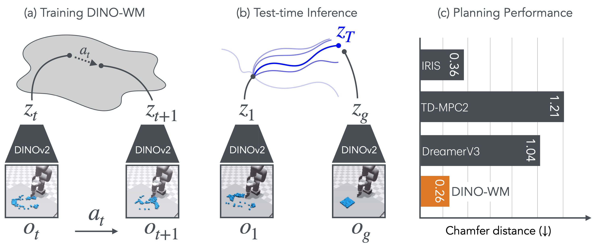

# **DINO-WM**: World Models on Pre-trained Visual Features enable Zero-shot Planning
[[Paper]](https://arxiv.org/abs/2411.04983) [[Code]]() [[Data]](https://osf.io/bmw48/?view_only=a56a296ce3b24cceaf408383a175ce28) [[Project Website]](https://dino-wm.github.io/) 

[Gaoyue Zhou](https://gaoyuezhou.github.io/), [Hengkai Pan](https://hengkaipan.github.io/), [Yann LeCun](https://yann.lecun.com/) and [Lerrel Pinto](https://www.lerrelpinto.com/), New York University, Meta AI



# Getting Started

1. [Installation](#installation)
2. [Datasets](#datasets)
3. [Train a DINO-WM](#train-a-dino-wm)
4. [Plan with a DINO-WM](#plan-with-a-dino-wm)

## Installation

Setup an environment
```bash
git clone https://github.com/gaoyuezhou/dino_wm.git
cd dino_wm
conda env create -f environment.yaml
conda activate dino_wm
```

### Install Mujoco
                    
Create the `.mujoco` directory and download Mujoco210 using `wget`:

```bash
mkdir -p ~/.mujoco
wget https://mujoco.org/download/mujoco210-linux-x86_64.tar.gz -P ~/.mujoco/
cd ~/.mujoco
tar -xzvf mujoco210-linux-x86_64.tar.gz
```

Append the following lines to your `~/.bashrc`:

```bash
# Mujoco Path. Replace `<username>` with your actual username if necessary.
export LD_LIBRARY_PATH=$LD_LIBRARY_PATH:/home/<username>/.mujoco/mujoco210/bin

# NVIDIA Library Path (if using NVIDIA GPUs)
export LD_LIBRARY_PATH=$LD_LIBRARY_PATH:/usr/lib/nvidia
```

Reload your shell configuration to apply the environment variable changes:

```bash
source ~/.bashrc
```

#### Notes
- For GPU-accelerated simulations, ensure the NVIDIA drivers are correctly installed.
- If you encounter issues, confirm that the paths in your `LD_LIBRARY_PATH` are correct.
- If problems persist, refer to these GitHub issue pages for potential solutions: [openai/mujoco-py#773](https://github.com/openai/mujoco-py/issues/773), [ethz-asl/reinmav-gym#35](https://github.com/ethz-asl/reinmav-gym/issues/35).


The following are optional installation steps for planning in the deformable environments.

### Install PyFlex (optional for deformable environments)

Install PyFleX if you need to plan within the deformable environments. These installation instructions are adapted from [AdaptiGraph](https://github.com/Boey-li/AdaptiGraph/tree/main).

We are using a docker image to compile PyFleX. Make sure you have the following packages:
- [docker-ce](https://docs.docker.com/engine/install/ubuntu/)
- [nvidia-docker](https://github.com/NVIDIA/nvidia-docker#quickstart)

Full installation:
```bash
pip install "pybind11[global]"
sudo docker pull xingyu/softgym
```
Run `bash install_pyflex.sh`. You may need to `source ~/.bashrc` to `import PyFleX`.

Or you can manually run
```bash
# compile pyflex in docker image
# re-compile if source code changed
# make sure ${PWD}/PyFleX is the pyflex root path when re-compiling
sudo docker run \
    -v ${PWD}/PyFleX:/workspace/PyFleX \
    -v ${CONDA_PREFIX}:/workspace/anaconda \
    -v /tmp/.X11-unix:/tmp/.X11-unix \
    --gpus all \
    -e DISPLAY=$DISPLAY \
    -e QT_X11_NO_MITSHM=1 \
    -it xingyu/softgym:latest bash \
    -c "export PATH=/workspace/anaconda/bin:$PATH; cd /workspace/PyFleX; export PYFLEXROOT=/workspace/PyFleX; export PYTHONPATH=/workspace/PyFleX/bindings/build:$PYTHONPATH; export LD_LIBRARY_PATH=$PYFLEXROOT/external/SDL2-2.0.4/lib/x64:$LD_LIBRARY_PATH; cd bindings; mkdir build; cd build; /usr/bin/cmake ..; make -j"

# import to system paths. run these if you do not have these paths yet in ~/.bashrc
echo '# PyFleX' >> ~/.bashrc
echo "export PYFLEXROOT=${PWD}/PyFleX" >> ~/.bashrc
echo 'export PYTHONPATH=${PYFLEXROOT}/bindings/build:$PYTHONPATH' >> ~/.bashrc
echo 'export LD_LIBRARY_PATH=${PYFLEXROOT}/external/SDL2-2.0.4/lib/x64:$LD_LIBRARY_PATH' >> ~/.bashrc
echo '' >> ~/.bashrc
```

# Datasets

Dataset for each task can be downloaded [here](https://osf.io/bmw48/?view_only=a56a296ce3b24cceaf408383a175ce28). 

Once the datasets are downloaded, unzip them. For the deformable dataset, you need to combine all parts and then unzip:
```
zip -s- deformable.zip -O deformable_full.zip
unzip deformable_full.zip
```

Set an environment variable pointing to your dataset folder:
```bash
# Replace /path/to/data with the actual path to your dataset folder.
export DATASET_DIR=/path/to/data
```
Inside the dataset folder, you should find the following structure:
```
data
├── deformable
│   ├── granular
│   └── rope
├── point_maze
├── pusht_noise
└── wall_single
```


# Train a DINO-WM
Once you have completed the above steps, you can check whether you could launch training with an example command like this:

```
python train.py --config-name train.yaml env=point_maze frameskip=5 num_hist=3
```
You may specify models' output directory at `ckpt_base_path` in `conf/train.yaml`.

# Plan with a DINO-WM
Once a world model has been trained, you may use it for planning with an example command like this:

```
python plan.py model_name=<model_name> n_evals=5 planner=cem goal_H=5 goal_source='random_state' planner.opt_steps=30
```

where the model is saved at folder `<ckpt_base_path>/outputs/<model_name>`, and `<ckpt_base_path>` can be specified in `conf/plan.yaml`.

<!-- ## Acknowledgement
TODO -->

# Pre-trained Model Checkpoints

We have uploaded our trained world model checkpoints for PointMaze, PushT, and Wall [here](https://osf.io/bmw48/?view_only=a56a296ce3b24cceaf408383a175ce28) under `checkpoints`. You can launch planning jobs with their respective configs in the repo:

First, update `ckpt_base_path` to where the checkpoints are saved in the plan configs.

Then launch planning runs with the following commands:
```bash
# PointMaze
python plan.py --config-name plan_point_maze.yaml model_name=point_maze
# PushT
python plan.py --config-name plan_pusht.yaml model_name=pusht
# Wall
python plan.py --config-name plan_wall.yaml model_name=wall
```

Planning logs and visualizations can be found in `./plan_outputs`.


## Citation

```
@misc{zhou2024dinowmworldmodelspretrained,
      title={DINO-WM: World Models on Pre-trained Visual Features enable Zero-shot Planning}, 
      author={Gaoyue Zhou and Hengkai Pan and Yann LeCun and Lerrel Pinto},
      year={2024},
      eprint={2411.04983},
      archivePrefix={arXiv},
      primaryClass={cs.RO},
      url={https://arxiv.org/abs/2411.04983}, 
}
```
